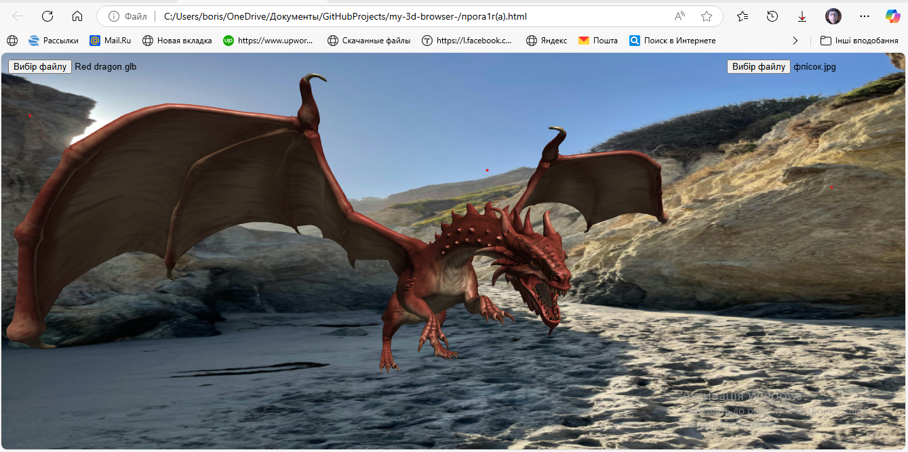

# my-3d-browser-
My 3D-visualization browser
# Простір для 3D-візуалізації у браузері: Інтуїтивні Налаштування та Можливості

 Це легкий та доступний веб-інструмент для створення та налаштування 3D-сцен прямо у вашому браузері. Він дозволяє завантажувати власні 3D-моделі та налаштовувати фон, освітлення та інші параметри через зручний користувацький інтерфейс.

## ✨ Ключові Можливості

* **Інтерактивна 3D-сцена:** Переглядайте та маніпулюйте об'єктами в реальному часі.
* **Просте завантаження GLTF/GLB моделей:** Миттєво інтегруйте власні 3D-моделі у сцену.
* **Кастомізація фону:** Змінюйте колір фону, завантажуйте фонові зображення.
* В майбутньому: **Налаштування освітлення:** Регулюйте колір та інтенсивність розсіяного та направленого світла для створення бажаної атмосфери.
* В майбутньому: **Зручний інтерфейс:** Всі налаштування доступні через інтуїтивно зрозумілу бічну панель.
* **Відкритий вихідний код:** Проєкт є повністю відкритим, запрошуючи до співпраці та вдосконалення.

## 🚀 Як Користуватися

1.  **Відкрийте сторінку:** Перейдіть за посиланням на GitHub Pages (див. вище) або завантажте `index.html` файл локально у ваш браузер.
2.  В майбутньому: **Бічна панель налаштувань:** Натисніть кнопку "Налаштування" у правому верхньому куті, щоб відкрити бічну панель керування.
3.  **Завантажуйте:** Використовуйте кнопки "Завантажити..." для додавання власних 3D-моделей (.gltf/.glb), фонових зображень (.png, .jpg) або відео (.mp4, .webm).
4.  В майбутньому: **Налаштовуйте:** Змінюйте колір фону, масштаб моделі, колір та інтенсивність освітлення за допомогою відповідних контролів.
5.  **Взаємодійте:** Обертайте та масштабуйте сцену за допомогою миші (або тачпада).

## 🎯 Кому це може бути корисно

* **3D-художники та дизайнери:** Для швидкого перегляду та демонстрації моделей.
* **Веб-розробники:** Як базовий приклад для інтеграції Three.js у веб-додатки.
* **Студенти та ентузіасти:** Для вивчення основ 3D-графіки у браузері.
* **Користувачі, яким потрібна проста візуалізація:** Для створення візуальних концептів без складного програмного забезпечення.

## 🤝 Співпраця та Внески

Цей проєкт є відкритим і ми вітаємо будь-які внески! Якщо у вас є ідеї щодо покращення, знайшли помилку або хочете додати нову функціональність:

1.  Форкніть репозиторій.
2.  Створіть нову гілку (`git checkout -b feature/AmazingFeature`).
3.  Внесіть свої зміни.
4.  Зробіть коміт (`git commit -m 'Add some AmazingFeature'`).
5.  Надішліть зміни до гілки (`git push origin feature/AmazingFeature`).
6.  Відкрийте Pull Request.

## 📜 Ліцензія

Цей проєкт поширюється за ліцензією [MIT License](LICENSE). Дивіться файл `LICENSE` для більш детальної інформації.
